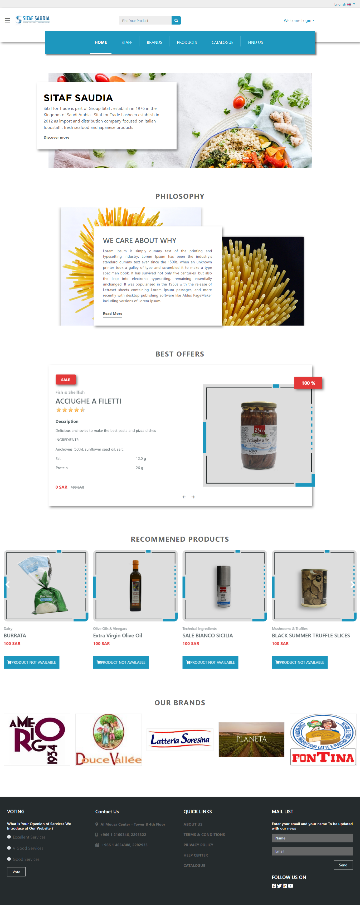

# SITAF-SAUDIA

Sitaf for Trade is part of Group Sitaf , establish in 1976 in the Kingdom of Saudi Arabia . Sitaf for Trade hasbeen establish in 2012 as import and distribution company focused on italian foodstaff , fresh seafood and japanese products
-----------

E-commerce website specializing in the sale of modern products and modern home products

Live Website preview
-----------
* (https://www.marketawy.com/sitaf4/) 

 Key features: 
-----------
* authentication by social login [Google and Facebook] and Capatcha for confiremation 
* Advanced search by product name, category , and brand.
* shopping Cart and wish list to saved items for later times.
* Shipping system by region and areas multiple shipping methods like(Interno delivery,Bosta , Aramex , Fedex).
* checkout with different payment methods.
* admin dashboard to control the content of the website view

Screenshot
-----------

  

About me
-----------
 You can follow me at:
1. [Linkedin](https://github.com/AhmeHalim)
2. [Linkedin](https://www.linkedin.com/in/ahmed-abd-el-halim/)
3. [Facebook](https://www.facebook.com/ahmed.elgheny.14)

  

